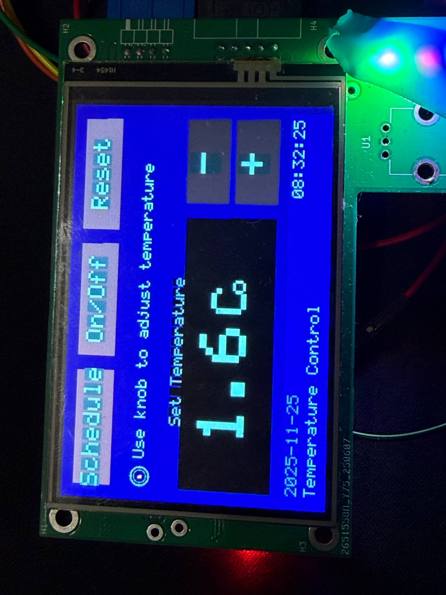
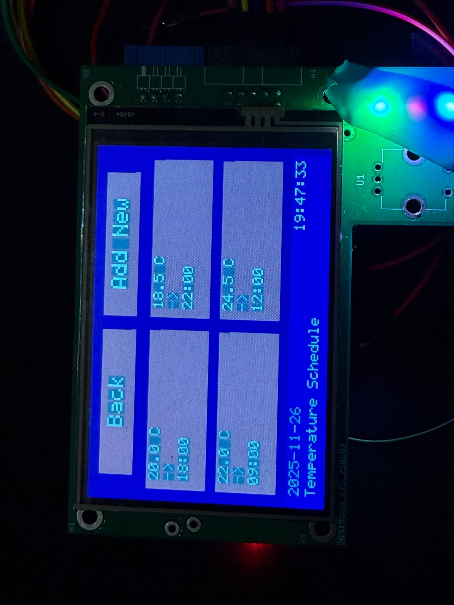
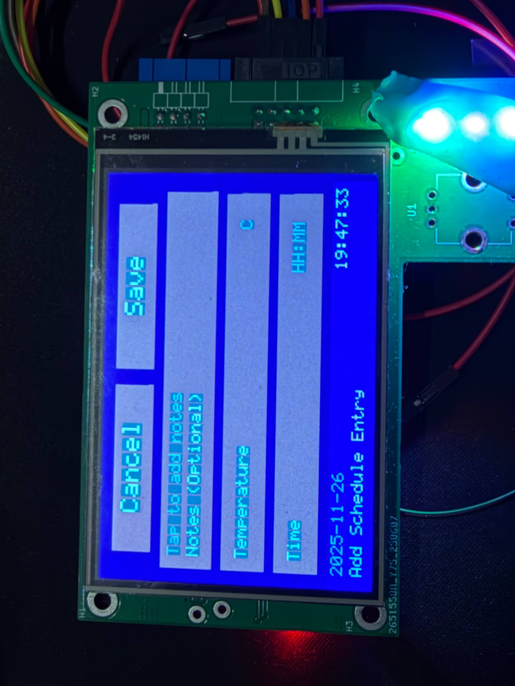

# STM32H562RGV6 Display Board - GUI Implementation

## Screenshots

<div style="display: flex; gap: 10px;">
  <div>
    <br>
    <small>Temperature Control Screen</small>
  </div>
  <div>
    <br>
    <small>Schedule Screen</small>
  </div>
  <div>
    <br>
    <small>Add Schedule Screen</small>
  </div>
</div>

## Overview
This project implements a touchscreen GUI for a temperature control system on an STM32H5 microcontroller with an ILI9488 480x320 TFT display.

## Screens Implemented

### 1. Temperature Control Screen (`Plot_Touchscreen_Temperature_Screen`)
The main screen for temperature control and monitoring.

**Features:**
- Large, centered temperature display with precise positioning
- Increase/Decrease buttons (+/-) on the right side
- Knob indicator with visual logo showing rotary encoder support
- Three bottom navigation buttons: Schedule, On/Off, Reset
- Header with date and time display
- Clean, minimal design with simple gray color scheme

**Layout:**
- Header: 50px height with title, date (left), and time (right)
- Temperature box: 330×110px, black background with white text
- Adjustment buttons: 52px height each, equal size, vertically centered
- Bottom buttons: 140px width each, evenly spaced

**Color Scheme:**
- Background: NAVY_BLUE
- Header: DARK_BLUE
- Buttons: GRAY/DARK_GRAY with WHITE text
- Temperature display: BLACK background, WHITE text

### 2. Schedule Screen (`Plot_Touchscreen_Schedule_Screen`)
Displays scheduled temperature changes in a 2-column grid layout.

**Features:**
- 2×2 grid of schedule entry boxes
- Each box shows: Time → Temperature
- Two bottom buttons: Back (to Temperature screen) and Add New (to Add Schedule screen)
- Consistent styling matching the Temperature screen

**Layout:**
- Schedule boxes: ~219px × 80px each
- 15px spacing between boxes
- 12px internal padding for text
- Text scale: 2.5 for better readability

**Color Scheme:**
- Background: NAVY_BLUE
- Schedule boxes: GRAY background
- Text: WHITE for time/temperature, LIGHT_GRAY for arrows

### 3. Add Schedule Screen (`Plot_Touchscreen_AddSchedule_Screen`)
Screen for creating new schedule entries.

**Features:**
- Three input cards: Time, Temperature, and Notes (optional)
- Vertically centered layout
- Two bottom buttons: Cancel and Save (both return to Schedule screen)
- Clean, organized design

## Navigation Flow

```
Temperature Screen (Main)
    ↓ [Schedule button]
Schedule Screen
    ↓ [Add New button]        ↑ [Back button]
Add Schedule Screen            ↑
    ↓ [Cancel/Save button]
Schedule Screen
    ↑ [Back button]
Temperature Screen
```

**Navigation Buttons:**
- **Temperature Screen**: Schedule → Schedule Screen, On/Off → Toggle system, Reset → Reset temperature
- **Schedule Screen**: Back → Temperature Screen, Add New → Add Schedule Screen
- **Add Schedule Screen**: Cancel → Schedule Screen, Save → Schedule Screen

## Files Modified

- `Core/Src/GUI.c`: Main GUI implementation
- `Core/Inc/GUI.h`: Function declarations
- `Core/Src/main.c`: Screen initialization and testing

## Usage

The screens are called in sequence in `main.c`:
```c
Plot_Touchscreen_Temperature_Screen(16, 2025, 11, 25, 8, 32, 25);
Plot_Touchscreen_Schedule_Screen(2025, 11, 26, 19, 47, 33);
Plot_Touchscreen_AddSchedule_Screen(2025, 11, 26, 19, 47, 33);
```
